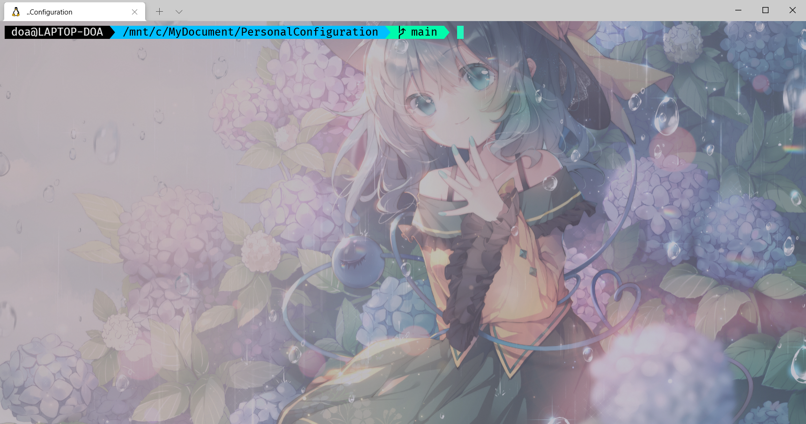

# Personal Configuration
There are my personal configurations for some software.

## Windows Terminal

- `Windows Terminal`文件夹中，包含`Windows Terminal`的配置文件：`setting.json`，该文件应放在`C:\Users\<username>\AppData\Local\Packages\Microsoft.WindowsTerminal_8wekyb3d8bbwe\LocalState`中。

参考效果图（命令行提示样式是zsh主题的效果、背景图需要你自行修改）：

## zsh

- `zsh`文件夹下包含`zsh`的配置文件`.zshrc`，直接覆盖home目录的原文件即可